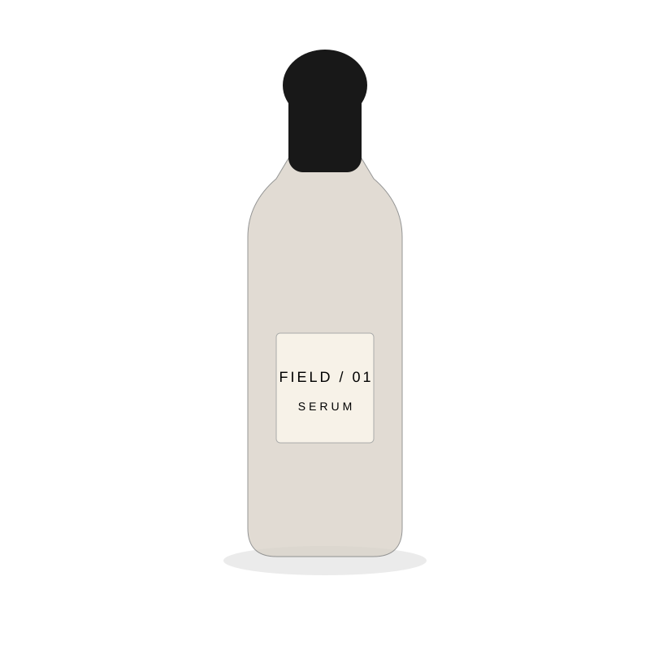
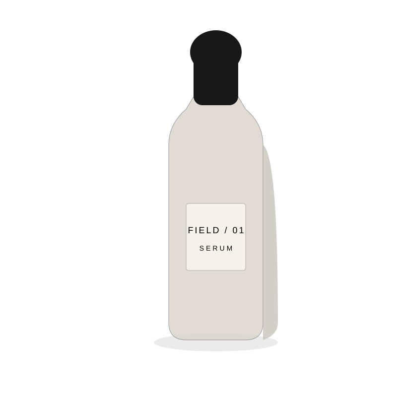
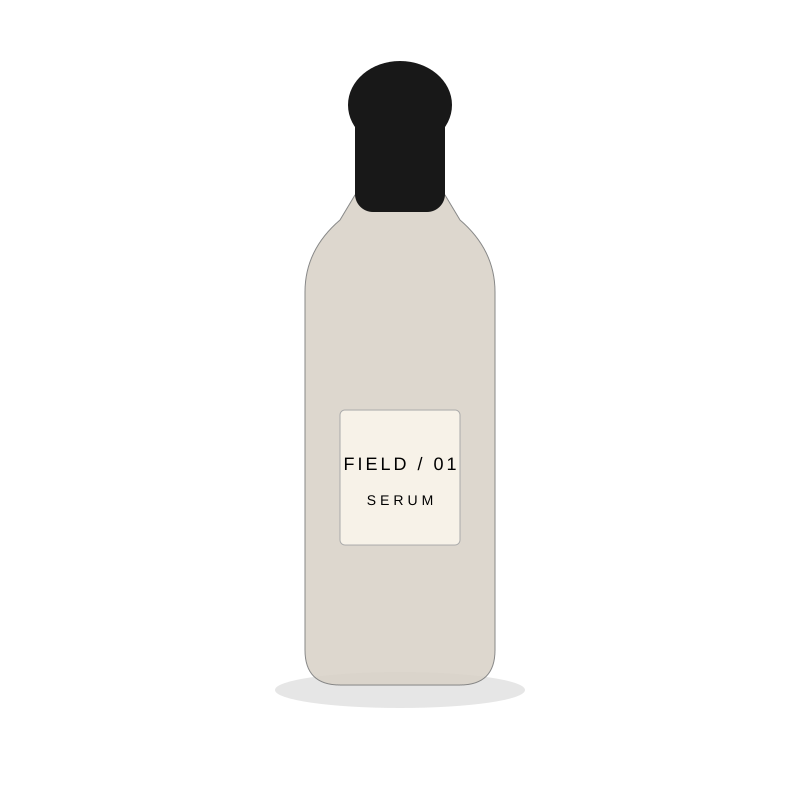
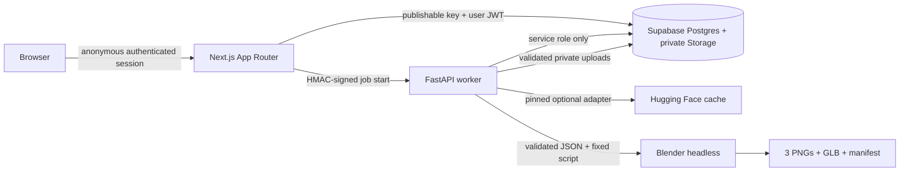

# Product Twin

Turn a skincare product photo into a realistic, editable 3D product twin and studio render.

Product Twin is a controlled packaging reconstruction system, not a generic image-to-3D generator. Hugging Face models are optional perception adapters. A canonical packaging specification stores the inferred physical decisions. The user corrects those decisions. Blender remains the authoritative geometry, material, camera, rendering, and export engine.

<table>
<tr>
<td></td>
<td></td>
<td></td>
</tr>
<tr><td>Front</td><td>Three-quarter</td><td>Ecommerce</td></tr>
</table>

## Product Twin v0.1

The first vertical slice proves one complete loop for the `round-dropper` archetype:

1. Authenticate anonymously through Supabase.
2. Upload one front product photo, optional label artwork, product name, and measured height.
3. Store source assets privately and produce an explicit model or no-op isolation result.
4. Review and edit the inferred packaging specification.
5. Approve that specification before a render job can be created.
6. Generate named Blender geometry, three studio renders, a GLB, and a debug manifest.
7. View the GLB interactively and download outputs through signed URLs.

Deterministic fixture mode exercises the full product flow without Supabase, model weights, a GPU, or paid inference. Fixture artifacts are generated deterministically by a dependency-free Node script during `pnpm install`, so the model-free path remains byte-safe and reproducible.

## Architecture



Read the durable design notes in:

- [System architecture](docs/architecture.md)
- [Packaging specification](docs/packaging-schema.md)
- [Hugging Face model decisions](docs/model-decisions.md)
- [Blender generator](docs/blender-generator.md)
- [Security](docs/security.md)

## Repository layout

```text
apps/web                         Next.js product flow and Three.js viewer
apps/worker                      FastAPI, model adapters, job processor, Blender generator
packages/packaging-schema        Canonical JSON Schema, Zod types, parity tests
packages/test-fixtures           Fictional product photo, label, and approved spec
supabase                         Versioned migration, local config, pgTAP RLS tests
infra/huggingface-space          Deploy-ready CPU Docker Space wrapper
infra/docker                     Optional local worker compose file
docs/evidence                    Reproducible fixture outputs used in this README
```

## Local development

Prerequisites: Node 24, pnpm 11.15, Python 3.11 to 3.13, uv, Docker, Supabase CLI 2.101, and Blender for authoritative renders.

```bash
corepack enable
pnpm install
pnpm fixtures:materialize
supabase start
cp .env.example .env.local
pnpm dev
```

In a second terminal:

```bash
cd apps/worker
uv sync --extra dev
uv run uvicorn product_twin.api:app --reload --port 7860
```

Generate the deterministic fixture without Supabase or model downloads:

```bash
cd apps/worker
uv run product-twin render-fixture \
  --spec ../../packages/test-fixtures/round-dropper/spec.json \
  --label ../../packages/test-fixtures/round-dropper/label.png \
  --output ./tmp/fixture-output
```

When Blender is installed, the CLI uses Blender. When it is absent, fixture mode records an explicit deterministic fallback in `manifest.json`; it never claims Blender ran.

## Environment variables

| Variable | Surface | Purpose |
|---|---|---|
| `NEXT_PUBLIC_SUPABASE_URL` | browser and server | Supabase project URL |
| `NEXT_PUBLIC_SUPABASE_PUBLISHABLE_KEY` | browser and server | Browser-safe publishable key |
| `PRODUCT_TWIN_FIXTURE_MODE` | server and worker | Enables deterministic local and preview flow |
| `PRODUCT_TWIN_WORKER_URL` | Next.js server | Private worker base URL |
| `PRODUCT_TWIN_INTERNAL_SECRET` | Next.js server and worker | At least 32 random bytes for nonce-bound HMAC mutation authentication |
| `SUPABASE_URL` | worker | Supabase REST and Storage base URL |
| `SUPABASE_SERVICE_ROLE_KEY` | worker only | Bypasses RLS for trusted job processing |
| `PRODUCT_TWIN_BACKGROUND_PROVIDER` | worker | `deterministic-fixture`, `noop`, or `birefnet` |
| `HF_HOME` | worker | Configurable Hugging Face model cache |
| `BIREFNET_MODEL_ID` | worker | Optional background provider repository |
| `BIREFNET_MODEL_REVISION` | worker | Exact pinned repository revision |
| `ENABLE_DEBUG_VIEW` | Next.js server | Explicit production opt-in for the safe debug route |

## Validation

```bash
pnpm lint
pnpm typecheck
pnpm test
pnpm schema:check
pnpm build
pnpm test:e2e

cd apps/worker
uv run ruff check product_twin tests
uv run pytest

cd ../..
supabase start
supabase db reset
supabase test db
```

The dedicated **Blender authoritative** workflow installs Blender, renders the fictional fixture, parses the GLB, verifies required named nodes, checks image dimensions and alpha behavior, requires literal white ecommerce corners, and enforces the 10 MB fixture target. The **Worker Space package** job builds and starts the Docker Space at the exact commit, checks health, and runs the same CPU fixture without downloading model weights.

## Deployment

- **Vercel:** import the repository root so `vercel.json` can build the `apps/web` workspace with the committed frozen lockfile. Configure only publishable Supabase values plus server-only worker values. Fixture previews set `PRODUCT_TWIN_FIXTURE_MODE=true` and display that state in the masthead. Blender never runs in Vercel Functions.
- **Supabase:** apply every committed migration in timestamp order with `supabase db push`. The historical prototype migration is followed by a guarded reconciliation and foreign-key indexes; both current buckets remain private and all exposed tables use RLS.
- **Hugging Face:** create a Docker Space from `infra/huggingface-space`, build with an immutable `PRODUCT_TWIN_REF`, then add Supabase and a 32-byte-or-longer HMAC value as Space secrets. The unprivileged free CPU baseline renders deterministic Blender output without a GPU.

## Known limitations

Only round droppers are supported. A single front image cannot reveal unseen side geometry, exact thread pitch, or perfect label typography. The no-op analysis fallback preserves usability but does not remove a background. BiRefNet remains optional because its repository does not declare an explicit license. CPU Blender rendering is slower than local desktop rendering.

Roadmap work is tracked in focused GitHub issues rather than hidden in v0.1.
