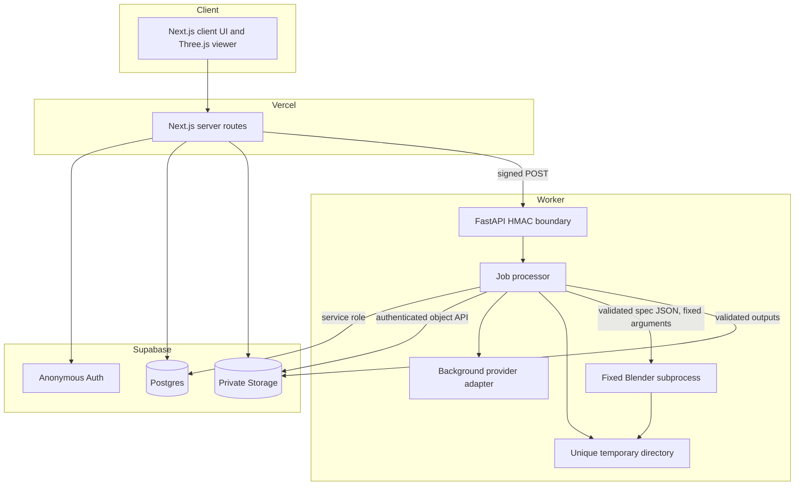
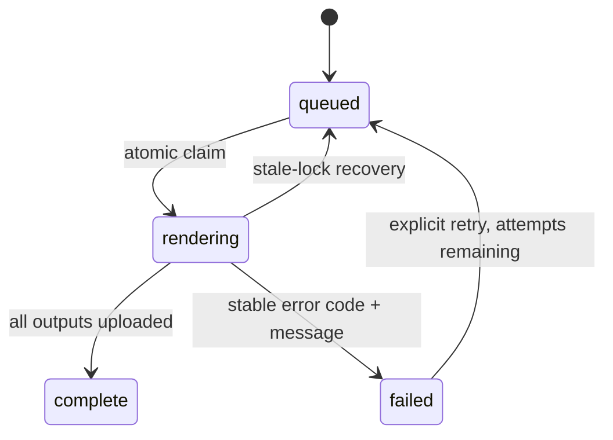

# Product Twin architecture

## System boundaries

## Trust boundaries

### Browser

The browser receives only the Supabase project URL and publishable key. It may create an anonymous authenticated session, upload allowed image types, edit a local Zod-validated specification, and call same-origin Next.js routes. It never receives the service-role key, worker HMAC secret, arbitrary object paths, shell commands, or model tokens.

### Next.js server

Next.js confirms the current user with `auth.getUser()`, relies on RLS for ownership, validates upload size, MIME type, and image signature, validates the packaging specification again, creates render jobs, and signs worker starts with method, path, timestamp, a single-use nonce, and body digest. It permits HTTP worker URLs only on loopback and requires HTTPS remotely. It does not run Blender or long inference.

### Worker

The worker is the only component with the Supabase service-role key. It claims a job atomically, validates the approved spec with Pydantic, downloads only paths prefixed by the job owner UUID, selects a configured perception adapter, and invokes a fixed Blender script with an argument list and no shell. Internal mutation endpoints require a fresh nonce-bound HMAC signature and reject replay.

### Blender subprocess

Blender receives a canonical JSON file, optional downloaded label artwork, and a unique output directory. Requests cannot supply Python, shell fragments, Blender scripts, or arbitrary paths. Blender validates the schema independently before creating a scene.

## Supabase flow

1. Anonymous authentication produces a stable authenticated user UUID.
2. `projects`, `assets`, `packaging_specs`, and `render_jobs` store `user_id`.
3. Every exposed table has RLS using `(select auth.uid()) = user_id`.
4. `product-uploads` and `product-outputs` are private.
5. Object paths start with `<user_id>/<project_id>/...`.
6. The browser receives time-limited signed URLs for reads and downloads.
7. The service role remains in the worker environment only.

## Job state machine

`claim_render_job` is a `SECURITY INVOKER` SQL function. Execution is revoked from `public`, `anon`, and `authenticated`, then granted only to `service_role`. It increments `attempt_count`, accepts queued jobs or locks older than 15 minutes, and refuses a fourth automatic attempt.

## File lifecycle

1. Source photo and label artwork are uploaded to a private user-prefixed path.
2. The worker creates `product-twin-<job-id>-*` under the configured temporary root.
3. It downloads source inputs through authenticated Storage requests.
4. The selected background provider writes an isolated image and optional alpha mask; every fallback is recorded.
5. Blender writes three PNGs, one GLB, and a manifest into the job directory.
6. Structural validation rejects missing, empty, oversized, or incorrectly named outputs.
7. Files upload to private output paths and receive matching `assets` rows.
8. Temporary files are deleted automatically when the context exits.

## Failure recovery

Failures store a stable machine code separately from a bounded human-readable message. Job and project status become `failed`, locks are cleared, and temporary files are removed. A worker crash leaves a lock that becomes claimable after 15 minutes. Automatic attempts are capped at three. Replacing the database-backed claim with a durable queue later does not change the packaging schema or Blender boundary.
